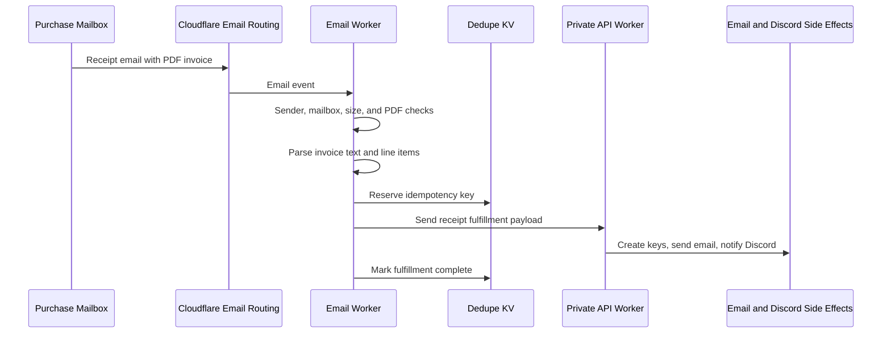

# Purdue Photo Email Worker

<div align="center">

Cloudflare Email Routing Worker that turns purchase receipt emails into private API fulfillment requests for Purdue Photography Club.

[](https://github.com/PurduePhotographyClub/purdue-photo-email-worker/actions/workflows/ci.yml)


</div>

## What It Does

The Email Worker receives routed receipt emails, validates the sender, parses TooCOOL PDF invoices, classifies purchases, deduplicates each order line, and forwards fulfillment payloads to the private API Worker.

## Flow



## Purchase Handling

| Purchase kind | Worker behavior | API behavior |
| --- | --- | --- |
| Membership | Builds a membership fulfillment payload | Creates activation key, sends member email, posts Discord notification |
| Film rolls | Builds a merchandise-style receipt payload | Posts Discord notification |
| Prints | Builds a merchandise-style receipt payload | Posts Discord notification |

The worker protects both ingress and fulfillment with idempotency. It reserves a key before calling the API, deletes the reservation if the API rejects the payload, and marks the key complete after success.

## Tech Stack

| Layer | Technology |
| --- | --- |
| Runtime | Cloudflare Workers Email handler |
| Routing | Cloudflare Email Routing |
| PDF parsing | `unpdf` |
| MIME parsing | `postal-mime` |
| Storage | Cloudflare KV for receipt dedupe |
| API boundary | Cloudflare service binding to the private API Worker |

## Development

```sh
npm install
npm run dev
```

Runtime secrets, sender allowlists, and routing settings are managed outside this public repository.

## Verification

```sh
npm run typecheck
npm run build
npm run doctor
npm run verify
```

`npm run build` performs a Wrangler dry-run deploy, which validates the Worker bundle without publishing it.

## Project Map

```text
src/index.ts                 Email handler, receipt parser, dedupe flow, and API forwarding
worker-configuration.d.ts    Generated Cloudflare binding types
wrangler.toml                Worker metadata and non-secret bindings
```

## Operational Notes

- Reject unexpected recipients before parsing.
- Reject unauthorized senders before reading attachments.
- Limit raw email and PDF sizes to protect Worker memory.
- Parse only supported TooCOOL receipt lines.
- Keep fulfillment idempotent across both KV and the API database.
- Deploy the API before this Worker because fulfillment is owned by the API.

## Assets And Licensing

This repo does not bundle image assets. Receipt PDFs are inbound operational documents and are not stored as repository assets.
