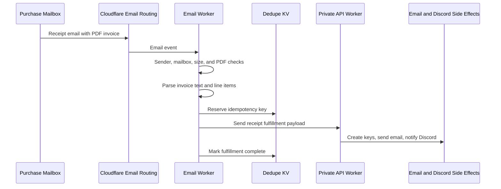

# Purdue Photo Email Worker

<div align="center">

Cloudflare Email Routing Worker that turns purchase receipt emails into private API fulfillment requests for Purdue Photography Club.

[](https://github.com/PurduePhotographyClub/purdue-photo-email-worker/actions/workflows/ci.yml)


</div>

## What It Does

The Email Worker receives routed receipt emails, validates the sender, parses TooCOOL PDF invoices, classifies purchases, deduplicates each order line, and forwards fulfillment payloads to the private API Worker.

## Flow


```mermaid
sequenceDiagram
  participant Mailbox as Purchase Mailbox
  participant Routing as Cloudflare Email Routing
  participant Worker as Email Worker
  participant KV as Dedupe KV
  participant API as Private API Worker
  participant SideEffects as Email and Discord Side Effects

  Mailbox->>Routing: Receipt email with PDF invoice
  Routing->>Worker: Email event
  Worker->>Worker: Sender, mailbox, size, and PDF checks
  Worker->>Worker: Parse invoice text and line items
  Worker->>KV: Reserve idempotency key
  Worker->>API: Send receipt fulfillment payload
  API->>SideEffects: Create keys, send email, notify Discord
  Worker->>KV: Mark fulfillment complete
```

## Purchase Handling

| Purchase kind | Worker behavior | API behavior |
| --- | --- | --- |
| Membership | Builds a membership fulfillment payload | Creates activation key, sends member email, posts Discord notification |
| Film rolls | Builds a merchandise-style receipt payload | Posts Discord notification |
| Prints | Builds a merchandise-style receipt payload | Posts Discord notification |

The worker protects both ingress and fulfillment with idempotency. It reserves a key before calling the API, retains retryable failures for bounded delivery attempts, and marks the key complete after success.

## Tech Stack

| Layer | Technology |
| --- | --- |
| Runtime | Cloudflare Workers Email handler |
| Routing | Cloudflare Email Routing |
| PDF parsing | `unpdf` |
| MIME parsing | `postal-mime` |
| Storage | Cloudflare KV for receipt dedupe |
| API boundary | Cloudflare service binding to the private API Worker |

## Development

```sh
npm install
npm run dev
```

Runtime secrets and Email Routing rules are managed outside this public repository. The dashboard must provide the single exact receipt sender; an empty, wildcard, or multi-address setting fails closed. The Worker fetches this policy for every email and may use a validated last-known-good KV copy for no more than 15 minutes only when the API is unreachable, rate limited, or returning a 5xx response. Authentication, route, and invalid-config responses always fail closed. Both configuration and fulfillment calls use the dedicated `EMAIL_WORKER_INTERNAL_TOKEN` secret; the shared API token is never accepted as a fallback.

## Verification

```sh
npm run typecheck
npm run build
npm run doctor
npm run verify
```

`npm run build` performs a Wrangler dry-run deploy, which validates the Worker bundle without publishing it.

## Project Map

```text
src/index.ts                 Email handler, receipt parser, dedupe flow, and API forwarding
worker-configuration.d.ts    Generated Cloudflare binding types
wrangler.toml                Worker metadata and non-secret bindings
```

## Operational Notes

- Reject unexpected recipients before parsing.
- Require the envelope sender and the single parsed RFC 5322 `From` mailbox to match the configured sender exactly.
- Limit raw email and PDF sizes to protect Worker memory.
- Parse only supported TooCOOL receipt lines.
- Keep fulfillment idempotent across both KV and the API database.
- Retry transport, 401, 403, 404, rate-limit, and server failures with exponential backoff for at most five total attempts; move exhausted items to `receipt-failed:` while 400, 409, and 422 responses dead-letter immediately.
- Re-check the current sender policy once per scheduled retry sweep and dead-letter queued receipts from missing or revoked senders without calling the fulfillment API.
- Deploy the API before this Worker because fulfillment is owned by the API.

## Assets And Licensing

This repo does not bundle image assets. Receipt PDFs are inbound operational documents and are not stored as repository assets.
